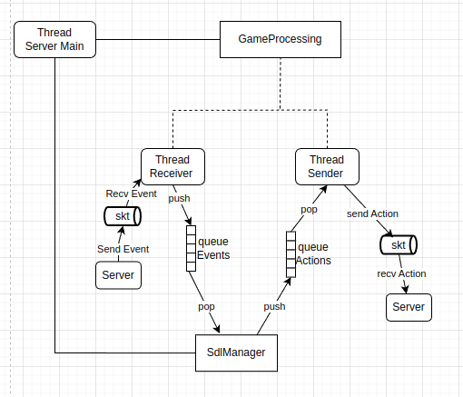
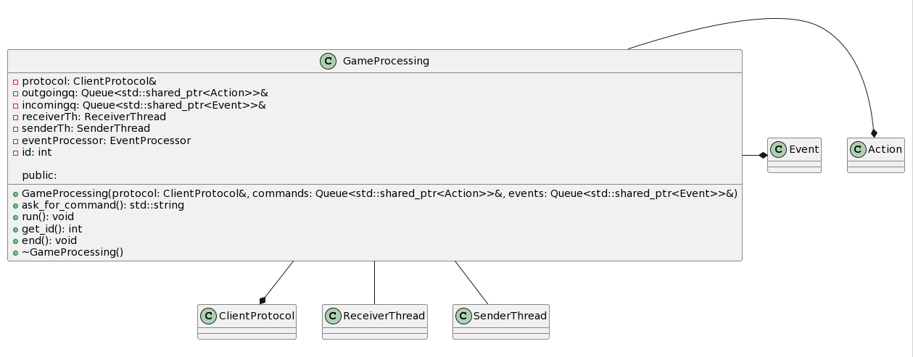
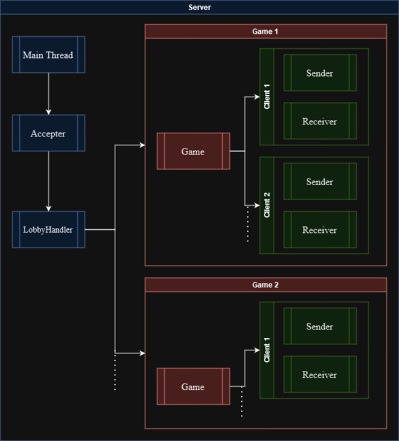
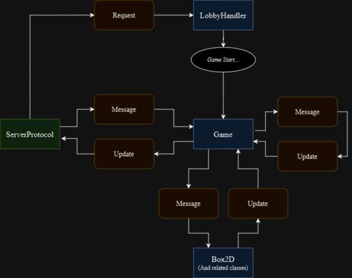
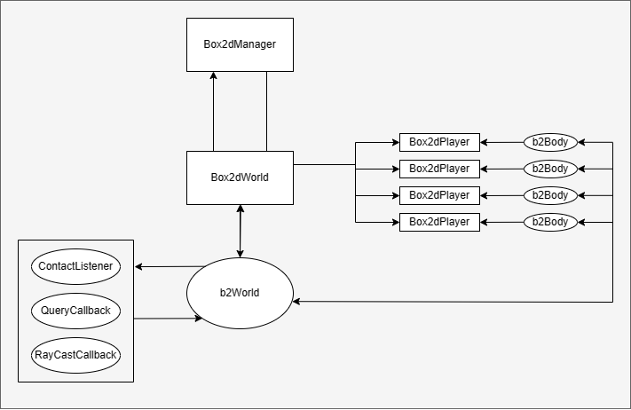

# DOCUMENTACION TECNICA

# Tabla de Contenidos

- [DOCUMENTACION TECNICA](#documentacion-tecnica)
- [Tabla de Contenidos](#tabla-de-contenidos)
- [Introduccion](#introduccion)
- [Requerimientos del sistema](#requerimientos-del-sistema)
- [Descripcion general](#descripcion-general)
- [Modulo cliente](#modulo-cliente)
- [Modulo servidor](#modulo-servidor)
  - [Lobby](#lobby)
  - [Lógica del juego](#lógica-del-juego)
  - [Box2D](#box2d)
  - [Protocolo de comunicación](#protocolo-de-comunicación)

# Introduccion

Este TP busca implementar una copia del videojuego Worms, juego multijugador con sistema de turnos en el que pueden jugar
2 o mas jugadores.

# Requerimientos del sistema

El proyecto se ejecuta en un sistema operativo GNU/Linux y se utilizan distintas librerias, necesarias para poder
compilar y ejecutar el juego. Estas son las siguientes:

- SDL2pp
  Esta librerı́a es el motor gráfico del juego, se encarga de todo lo relacionado con la renderización,
  musicalización e interacción con el usuario (Cliente), determinando cada acción del usuario para luego
  mostrarla en pantalla. Se utiliza tambien para el editor de mapas

- Box2d
  Box2D es una biblioteca libre que implementa un motor físico en dos dimensiones. Se utiliza para implementar
  toda la fisica del juego

- QT
  Qt5, es una librerı́a que, utiliza el lenguaje de programacion C++, para trabajar con interfaz gráfica. En este
  proyecto se utiliza el module de Widgets para la creacion de la interfaz mediante el uso de buttons, labels,
  lineEdits, etc. Se utiliza en el Launcher, para que el usuario pueda crear nuevas partidas o unirse a alguna

- YAML-cpp
  Se utiliza para parsear archivos YAML, mas especificamente los mapas en los cuales se puede jugar. Cuando el editor
  crea un nuevo mapa, se genera un nuevo archivo YAML que se guarda en la carpeta del proyecto

# Descripcion general

El trabajo cuenta con dos programas ejecutables, un cliente y un servidor, estos tendrán interacción
por medio de un protocolo de comunicación basado en sockets TCP/IP.
En el contexto de una aplicación o juego, el cliente cumple un papel fundamental al gestionar la
comunicación con el usuario en la parte visible y accesible de la interfaz (front-end). Esto implica que
el cliente no solo recibe y procesa los eventos que ocurren, sino también las acciones que el usuario
realiza. Por otro lado, el servidor asume la responsabilidad de manejar toda la lógica del juego o la
aplicación (back-end), respondiendo de manera adecuada a las acciones que el usuario lleva a cabo.

# Modulo cliente

El módulo del cliente se encarga de establecer la conexión con el Servidor, gestionar las acciones
al Servidor y procesar los eventos recibidos por el Servidor.

El cliente tiene su interfaz gráfica, la cual consta del Launcher y del SdlManager.

El launcher, el cual esta construido mediante la libreria Qt5, es una parte importante del módulo del cliente en
este proyecto. Es una interfaz gráfica construida utilizando la biblioteca Qt5 que permite al usuario realizar
diferentes acciones, como crear nuevas partidas o unirse a partidas existentes.

El Launcher actúa como el punto de entrada para que el usuario interactúe con el juego. Proporciona una forma
intuitiva y fácil de acceder a las funcionalidades del juego.

Por otro lado se encuentra el SdlManager el cual es parte del módulo del cliente y se encarga de gestionar la interfaz
gráfica del juego utilizando la biblioteca SDL (Simple DirectMedia Layer).

El SdlManager se encarga de realizar tareas como la inicialización de la ventana del juego, la carga de recursos
gráficos (como imágenes y fuentes), la gestión de eventos de entrada del usuario (como teclado y mouse), y la
renderización de los elementos visuales en la pantalla.

En resumen, el SdlManager es responsable de proporcionar una interfaz gráfica interactiva y visualmente atractiva
para que el usuario pueda interactuar con el juego.

Ademas, el SdlManager recibe eventos del servidor para actualizar todas las posiciones y estados de los distintos gusanos
para que sean renderizados correctamente para cada uno de los jugadores que esten en la partida

El cliente tiene dos queues bloqueantes, una para enviar Acciones al servidor, y otra para recibir eventos de parte
del servidor. Para el manejo de la coneccion entre cliente-servidor, se utiliza el clientProtocol, el cual es el
encargado de recibir los mensajes y crear los eventos correspondientes, como tambien enviar las acciones como corresponda.

El cliente esta compuesto por tres threads:

- el thread main: ejecuta el launcher, luego una vez que se hayan ingresado los datos ejecuta el cliente (gameProcessing),
  y despues de eso ejecuta el sdlManager

- el thread Receiver: Su función principal es recibir eventos del servidor y pushearlos a la queue de eventos.
  En el contexto del juego, el servidor envía eventos al cliente para informar sobre cambios en el estado del juego, como
  movimientos de otros jugadores, disparos, actualizacion de posiciones, etc. El ClientReceiverThread se encarga de
  recibir estos eventos pushearlos a la queue de eventos. Estos eventos luego son poppeados y procesados por el SdlManager
  El hilo ClientReceiverThread utiliza una cola bloqueante para recibir los eventos del servidor. Una cola bloqueante es
  una estructura de datos que permite a un hilo esperar hasta que haya elementos disponibles

- el thread Sender: es el responsable de enviar acciones desde el cliente al servidor . Su función principal es tomar las
  acciones generadas por el jugador en el cliente y enviarlas al servidor para que se procesen y se reflejen en el estado del juego.
  En el contexto del juego, las acciones pueden incluir movimientos del jugador, disparos, etc. Estas acciones son capturadas
  por el cliente y se encolan en una cola bloqueante específica para el envío de acciones al servidor.

- el thread Sender se encarga de tomar las acciones de esta cola bloqueante y enviarlas al servidor a través del protocolo de
  comunicación establecido. Utiliza el clientProtocol, que es el encargado de recibir los mensajes y crear los eventos
  correspondientes para el servidor.

En la siguiente imagen se puede ver el flujo general de los threads del cliente:

La clase principal del cliente es el GameProccessing, cuyo diagrama de clase es el siguiente:

Esta clase tiene una referencia del protocolo, el cual se los envia a las clases Sender y Receiver, Tiene una queue de acciones y
una queue de eventos, las cuales son las mismas que tiene el SdlManager. Tiene tambien un sender y un receiver, los cuales son
threads que ejecuta en el run del cliente. Tambien se guarda su id, el cual es recibido cuando se conecta correctamente a la
partida.

# Modulo servidor

El servidor se divide en 3 partes principales: lógica del lobby, lógica del juego, y Box2D. En la fase de lobby el servidor maneja _requests_ del cliente relacionadas a la creación de una partida de forma síncrona, luego en la etapa del juego se realiza todo el procesamiento necesario para el desarrollo de la partida. Box2D maneja todas las simulaciones físicas, y hay una parte de arquitectura del servidor que maneja las cuestiones más "meta".

El esquema a nivel _threads_ del server es el siguiente:

Y la arquitectura a alto nivel del server en cuanto a la ejecución de una partida se resume en:

## Lobby

En la fase del lobby, una vez el thread aceptador establece conexión con un cliente se lanza un `LobbyHandlerThread` que procesa todas las comunicaciones con el cliente hasta justo antes de que se conecte efectivamente a una partida. Son _request_ síncronas, es decir, se recibe un mensaje del cliente, y se le devuelve una respuesta (como si fuera un servidor web). Esta etapa dura hasta que el cliente decida _crear o unirse_ a una partida. En ese punto, el thread procesa la lógica de la acción correspondiente (crear una nueva partida o asignarlo a una existente, con los checks pertinentes de existencia) y le refiere el socket asociado al cliente al objeto `Game` que es el que se va a encargar de orquestar el juego.

## Lógica del juego

Cada juego tiene asociado un thread de partida único, y dos thred de comunicación (enviar y recibir) por cliente.

**_Los threads de comunicación_** se comunican con el juego por medio de queues son bastante básicos: uno envía por el socket todo lo que recibe de una queue y el otro envía por una queue todo lo que recibe del socket. Los mensajes recibidos del cliente corresponden a la clase abstracta `Message`, mientras que las actualizaciones que devuelve el servidor a cada cliente son de la clase abstracta `Update`. En el thread del juego se realiza todo el procesamiento necesario para recivir un `Message` y obtener una `Update`.

**_El thread del juego_**, antes de empezar el loop principal, realiza el proceso de _inicio de partida_: espera a recibir una señal del anfitrión para empezar,reparte los gusanos disponibles entre los jugadores conectados, empieza el temporizador, y avisa a todos los jugadores que empezó la partida. A todos los jugadores se le envían 3 mensajes antes de empezar con el juego propiamente dicho (en este orden): una _señal_ de que el juego empezó, su _id de jugador_, y una _actualización del mundo_ (i.e. posiciones, vida, etc. de todos los gusanos).

El ciclo principal del thread del juego realiza las siguientes tareas:

- Recolecta todos los mensajes de jugadores a procesar
- Procesa dichos mensajes según sea pertinente, y envía la actualización correspondiente a todos los jugadores
- Envía además una update del temporizador y una update de mundo para asegurar que el cliente siempre la información más reciente
- Avisa a Box2D que ha transcurrido un tick, y duerme hasta que haya transcurrido el tiempo de un _tick_ de ser necesario.

Si bien la mayoría de los mensajes son recibidos del cliente y referidos al Box2D para su procesamiento, hay algunas excepciones. El juego puede producir "mensajes" por sí mismo, sin que le lleguen de un cliente, para aprovechar la interfaz polimórfica de procesamiento para ciertas tareas (p. ej. actualizar el temporizador o cambiar el turno), y también hay ciertos mensajes que no requieren procesamiento de Box2D así que los procesa el juego directamente (como los mismos 2 casos anteriores).

## Box2D

Box2D funciona de manera bastante independiente al objeto `Game` en sí. La interfaz básica de comunicacion exterior con Box2D se resume en:

- _Process_, que es el método que recibe el mensaje del cliente y devuelve la update del mundo del juego. Por dentro, Box2D se encarga de realizar todas las simulaciones físicas y de daño y devuelve toda la información sobre jugadores, proyectiles, etc. empaquetadas en una update que se le envía al cliente para que procese SDL.
- _Mensajes extra_ referidos a cuestiones de sincronización de información como avanzar un tick (ya que el tiempo lo lleva el servidor), asignar los equipos de los gusanos, etc.

#### Implementacion Particular de Box2D
- En Box2D el mundo gira en torno a un objeto llamado b2World que es la representacion del mundo fisico que estamos manipulando. En nuestro codigo el b2World es propiedad de la clase Box2dWorld. Box2dWorld esta principalmente encargado de la posesion del mundo. Sin embargo, quien interactua con el main del Server es Box2dManager.
  
- Box2dManager es una abstraccion superior al mundo. Principalmente se ocupa de permitir la comunicacion entre el servido con sus comandos entrantes con el Box2dWorld que es el encargado de luego ejectuarlo. Del mismo modo, permite una abstraccion mas simple de obtener los estados de mundo para comunicar en devolucion al Cliente. Se podria decir que Box2dManager es principalmente una API y abstraccion para Box2dWorld. De todos modos, tambien tiene algunas propiedades propias que permiten ejectuar cierta logica de juego.

- Box2dWorld es el objeto principal en toda la ejecucion de Box2D. Principalmente es dueña de b2World y es el unico que puede pedirle cosas. Todos sus metodos son privados, pero Box2dManager es una friend class por lo que la unica clase autorizada a interactuar con Box2dWorld es el Manager. De este modo protegemos a que solo el Manager pueda solicitar informacion y cambios. Particularmente box2dWorld tiene toda la creacion del escenario fisico, utilizando el CommonMapParser que al crearse le entrega toda la informacion. Luego estan todos los metodos que permiten implementar la logica de juego. Desafortunadamente, por falta de tiempo, no logramos emprolijar de la mejor manera todos estos metodos. 

    - Cabe destacar que hay tres clases auxiliares para el world que permiten la correcta simulacion fisica del los contactos y explosiones que son ContactListener, QueryCallback y RayCastCallback. Su existencia no tiene nada muy particular mas que necesidades de logica de Box2D que no vale la pena indagar.

-  Por ultimo, existe box2dPlayer, que es la abstraccion de cada jugador. Estas incluyen el b2Body que es el cuerpo fisico dentro de la simulacion (nos permite moverlo, saber donde esta, su velocidad, etc). Ambos su id de worm y el id de a que equipo pertenecen. Booleanos representando su estado, no es la implementacion ideal, pero es la implementacion mas rudimentaria que logre hacer. Por ultimo tiene los puntos de vida, ya que es la clase encargada de conocerlos. Toda esta informacion es fundamental que este aqui ya que es la clase que contiene toda la informacion que sera enviada al Client. Permite conocer toda la informacion necesaria para el renderizado. Hay un constructor especifico, el de 2 paramentros, que es utilizado por los proyectiles. No llegue a crear una clase especifica, pero ese constructor solo asigna que tipo de arma es y el b2Body asociado al proyectil para, nuevamente, conocer su posicion, velocidad, etc.

## Protocolo de comunicación

El protocolo del servidor es probablemente la clase más grande y una de las más útiles. Abstrae todas las comunicaciones con el cliente y se encarga de serializar y de-serializar toda la información que se intercambia. Gracias al protocolo y a las jerarquías polimórficas (`Request`, `Message`, `Update`), se puede implementar un nuevo tipo de paquete de comunicación en cuestión de minutos.

Las constantes comunes de comunicación entre el cliente y el servidor se encuentran definidas en un archivo común. Es un protocolo de comunicación binario, por lo que todos los mensajes empiezan con un _código_ (en nuestro caso de 1 byte) que indica qué tipo de mensaje se va a recibir, y a partir de ahí hay un acuerdo del resto de información pertinente y cómo debería ser envíada y/o recibida.
