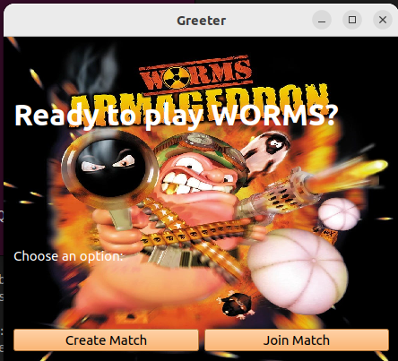

# MANUAL DE USUARIO

# Tabla de Contenidos

- [Guía de Instalación](#guia-de-instalación)
     - [Requisitos](#requisitos)
     - [Instalación de Dependencias](#instalación-de-dependecias)
- [Guía de Usuario](#guía-de-usuario)
     - [Formas de ejecución](#formas-de-ejecucción)
          - [Server](#server)
          - [Cliente](#cliente)
- [Cómo jugar](#cómo-jugar)
     - [Movimientos](#movimientos)
     - [Crear Partida](#crear-partida)
     - [Unirse a Partida](#unirse-a-partida)
- [Juego](#flujo-de-juego)
     - [Jugar](#jugar)
     - [Cheats](#cheats)

# Guía de instalación

## Requisitos

Uno de los requisitos más importantes que utiliza el juego es el sistema operativo sobre el cual se ejecuta, para lo cual se debera contar con alguna distribucion que utilice GNU/Linux como sistema operativo.

Además se debe contar con tanto git, CMake y Make, para la descarga del juego así como para la compilación del juego.

## Instalación de Dependencias

Para instalar CMake y make, corre los siguientes comandos:

sudo apt update
sudo apt install cmake
sudo apt install make

En este juego se utiliza SDL, para el cual hay que instalar diversos archivos:

- Para instalar y usar la versión 0.18 de libsdl2pp:
  sudo apt-get install libjpeg-dev libpng-dev libfreetype-dev libopusfile-dev libflac-dev libxmp-dev libfluidsynth-dev libwavpack-dev cmake libmodplug-dev libsdl2-dev

- Descargar los siguientes 3 zip:

     1. ( 2.6.3, https://github.com/libsdl-org/SDL_image/releases/tag/release-2.6.3)
     2. libsdl2-mixer (2.6.3, https://github.com/libsdl-org/SDL_mixer/releases/tag/release-2.6.3)
     3. libsdl2-ttf (2.20.2, https://github.com/libsdl-org/SDL_ttf/releases/tag/release-2.20.2)
        Hacer unzip de cada uno y luego ejecutar en cada respectiva carpeta:
        cd carpeta_sdl_x
        mkdir build
        cd build
        cmake ..
        make -j4
        sudo make install

     Luego ir a https://github.com/libSDL2pp/libSDL2pp/releases y descargarse el zip de la ultima version (libSDL2pp-0.18.1), hacer unzip y ejecutar:
     cd libSDL2pp-0.18.1
     mkdir build
     cd build
     cmake ..
     make -j4
     sudo make install

     con eso deberian estar todas las dependencias instaladas para utilizar SDL. Luego, ir a carpeta Images y hacer unzip de los 2 zip

Tambien se utiliza QT, para el cual se debe correr en la terminal el comando:
sudo apt-install qt5-default

Se utiliza tambien box2D, para el cual no se debe instalar nada manualmente, ya que se carga todo en su respectivo CMake

## Ejecutando el juego

Debe clonar el repositorio corriendo el siguiente comando en la terminal de la carpeta que usted quiera:

- https://github.com/Rpetey317/taller1-worms.git

Luego crear la carpeta build y ejecutar el CMake:
mkdir build
cd build
cmake ..
make

Esto creara los archivos ejecutables server y client.

# Guia de Usuario

## Formas de Ejecucion

### Server

En una terminal, localizarse en el directorio build, creado anteriormente, ingresa el comando:

- ./server <port number> . Como por ejemplo ./server 8080

### Cliente

## Sala de Espera

En otra terminal y parandote en el directorio build, ingrese el comando:

- ./client 127.0.0.1 <port number>. Como por ejemplo ./client 127.0.0.1 8080. Ambos deben tener el mismo port number.

Al poner el mismo numero de puerto, el cliente se conecta al server, para luego crear o unirse a una partida.

# Como Jugar

## Movimientos

El gusano tiene distintos movimientos, para los cuales se utilizan las siguientes teclas:

- Moverse hacia la izquierda y derecha: flechas izquierda y derecha
- Saltar: Tecla 'Enter' para salto hacia adelante, tecla 'Backspace' para salto hacia atras
- Elegir arma: Con las teclas de los numeros del 0 al 9 se eligen las distinas armas, las cuales son:
  Tecla 0: Bazooka
  Tecla 1: Mortero
  Tecla 2: Granada roja
  Tecla 3: Granada verde
  Tecla 4: Banana
  Tecla 5: Granada santa
  Tecla 6: Ataque aereo
  Tecla 7: Dinamita
  Tecla 8: Bate de beisbol
  Tecla 9: Teletransportacion

- Potencia de disparo: Con la barra espaciadora. Manteniendola apretada mas tiempo, hace el disparo mas fuerte
- Disparar: Soltando el espacio

## Launcher

Al conectarse el cliente con el servidor, se ejecuta el qt launcher, el cual le permite al usuario elegir unirse a una partida,
o crear una partida, como se puede ver en la siguiente imagen.

## Crear Partida

Se selecciona el boton 'Create Match', para el cual se abre el siguiente form, en el cual se rellena el nombre de la partida
que se quiere crear, seleccionando el mapa que se desea elegir, escribiendo la extension .yaml (por ejemplo: mapita.yaml).

Al apretar 'Accept', se abre otro QWidget el cual espera al jugador a empezar la partida. En este momento se espera a que se
conecten los demas jugadores que quieran jugar. Cuando se apreta 'Start Game', se comienza la partida.

## Unirse a Partida

Se selecciona el boton 'Join Game' para el cual se abre el siguiente form. en el cual se pide rellenar el nombre de la partida
a la cual se desea unir el jugador.

## Editor de mapas

Si se quiere crear un nuevo mapa, se debe correr en el directiorio build del proyecto el comando:
./client <nombre de mapa.yaml> , siendo el `nombre de mapa.yaml` el nombre de un mapa existente, si se quiere modificar el mapa, o un
nombre del nuevo mapa que se quiere crear, en este caso se crea un nuevo mapa. Si se toca la tecla 'Escape' , se guardan los
cambios correctamente, si se toca la X de la ventana donde se edita el mapa, no se guarda. Al guardarse los cambios, se crea o
modifica un archivo YAML, el cual se guarda en la carpeta 'Maps' del directorio, el cual tiene todos los mapas correspondientes.
Las teclas para el editor son las siguientes:
F1, F2, F3: Cambia el fondo de pantalla

1: Elegir viga corta
2: Elegir viga larga
3: Definir punto de spawn de gusanito
w, a, s, d : Mover la camara
Click izquierdo: Manter y colocar las piezas (vigas o gusanos)

# Flujo de juego

## Jugar

El juego esta implementado con un sistema de turnos, para el cual cada jugador tiene una determinada cantidad de tiempo (editable)
para actuar, ya sea moviendose y/o saltando y/o disparando. Cuando se termina ese tiempo, se pasa al siguiente jugador.
El juego fluye hasta que quede un solo jugador jugando.

## Cheats

Teclas de cheats:

- F1: Recargar balas
- F2: Setear la vida en 100 a todos los gusanos
- F3: Setear la vida en 1 a todos los gusanos
